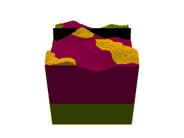
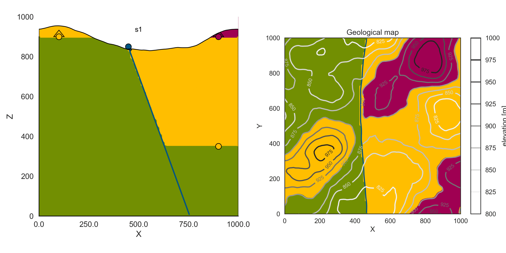
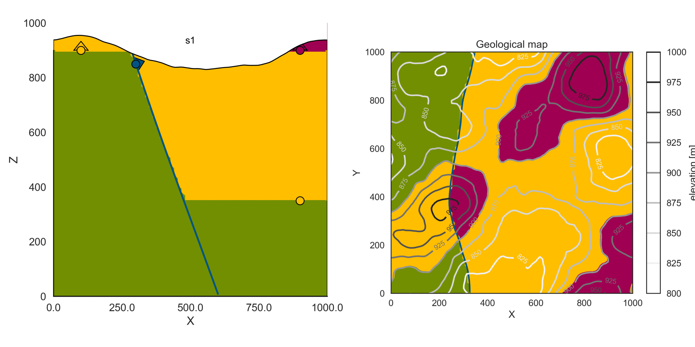
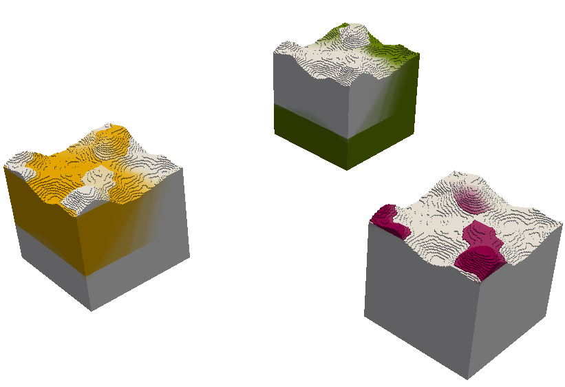
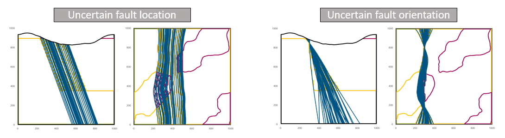

# gempy-examples
Things based on [GemPy](https://github.com/cgre-aachen/gempy), which I did during my master thesis time at CGRE and which I am too lazy to include in the main repo. All demonstrated on a simple example model with three different lithologies and one fault:

<strong>Important note:</strong> It is not guaranteed that these notebooks will run with the main version of gempy. Gempy is in active development and things are changing fast, which can lead to errors when running code in these notebooks. However, the code will always run with [this fork of gempy](https://github.com/elimh/gempy).

### Featuring: Stochastic simulations with... 

#### Uncertain locations

#### Uncertain orientations

#### (or both, of course!)

### Probability and entropy calculation and visualization

### Spaghetti plot creation to visualize multiple model outcomes

### ...